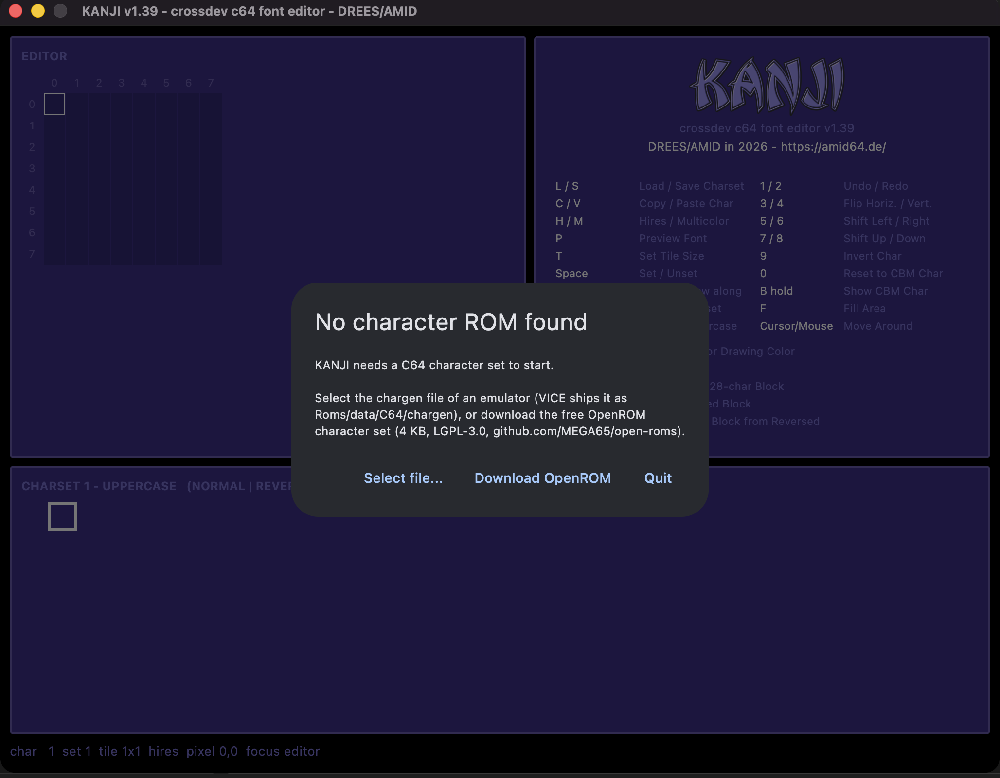

<p align="center">
  
</p>

<p align="center">Crossdev C64 Font Editor</p>

KANJI edits C64 fonts on a modern desktop: draw a character pixel by pixel,
see the whole charset update live, and preview how your font looks as
multi-character tiles before it ever touches real hardware.


---

## Features

- **Both C64 charsets** — uppercase/graphics and lowercase, 256 characters each
- **Hires and multicolor** — `H` and `M` switch; multicolor edits the same
  bytes in pairs, with the four colors picked from the C64 palette
- **Live preview** of the full charset, normal and reversed side by side
- **Tile formats** — 1x1, 1x2, 2x1 and 2x2, assembled exactly as the C64 does it
- **Font preview** showing characters 0–63 rendered as complete tiles
- **Draw by dragging** — hold the mouse button or `Space` and move; a stroke
  keeps setting or erasing, whichever the first cell called for
- **Fill** an enclosed area, **build the reversed block** from the normal one,
  **clear a whole 128-character block**
- **Transformations** — flip, shift, invert, clear, reset to the original CBM glyph
- **Undo/redo**, copy/paste between characters
- **Compare with the ROM** — hold `B` to see the original CBM character
- Reads and writes plain **`.64c` / `.bin`** charset dumps
- **Ready-made viewers** in BASIC and KickAssembler, see [`examples/`](examples/)

---

## Install

Download the archive for your system from the
[releases page](../../releases) — Windows, macOS and Linux, no Python
installation needed. You still need a chargen ROM (see below).

| System | Archive | Start |
|--------|---------|-------|
| Windows | `KANJI-windows.zip` | unpack, run `KANJI.exe` |
| macOS | `KANJI-macos.zip` | unpack, see below |
| Linux | `KANJI-linux.zip` | unpack, run `./KANJI` |

### Starting it on macOS

The app carries an ad-hoc signature, not one from a paid Apple Developer
account. macOS quarantines anything downloaded through a browser, and
Gatekeeper refuses to launch a quarantined app it cannot trace to a
registered developer. Double-clicking gives you *"kanji" is damaged and
can't be opened* — the file is fine, the message is Gatekeeper's.

Move `kanji.app` where you want it, then clear the quarantine flag once:

```bash
xattr -dr com.apple.quarantine /Applications/kanji.app
```

After that it starts by double-click like any other app. Repeat this after
downloading a new version — the flag comes back with every download.

*Right click → Open* used to be enough, but recent macOS versions no longer
offer that escape hatch for ad-hoc signed apps.

### From source

```bash
pip install -r requirements.txt
python3 kanji.py
```

Requires Python 3.9 or newer. To build a standalone app yourself you also need
the [Flutter SDK](https://docs.flutter.dev/get-started/install):

```bash
pip install -r requirements.txt
flet build macos --module-name kanji     # or: windows / linux
```

The app icon is `assets/icon.png`, a 1024x1024 square with no transparency.
One file covers every platform; `flet build` derives the `.icns` and `.ico`
variants from it.

Pushing a `v*` tag builds all three platforms via GitHub Actions and attaches
the archives to the release. Each target has to be built on its own platform —
there is no cross-compilation.

### The chargen ROM

KANJI needs the original C64 character generator ROM. It provides the starting
charset and is the reference for *Reset to CBM Char* and *Show CBM Char*.

The file ships with [VICE](https://vice-emu.sourceforge.io/) as
`Roms/data/C64/chargen` (4096 bytes). On the first start KANJI searches the
usual install locations on macOS, Linux and Windows. If it finds one, the path
is stored in `kanji.json` next to `kanji.py` and reused on every later start.

If nothing is found, KANJI asks you to select the file. **Without a valid ROM
the app will not start** — cancelling the dialog quits it.



To use a different ROM later, delete `kanji.json` or edit the path inside it.
You can also drop a file named `chargen` next to `kanji.py`.

---

## The window

```
┌───────────────────────────┬───────────────────────────┐
│ (1) EDITOR                │ (2) KANJI + key reference │
│     pixel grid + tile     │                           │
│     preview               │                           │
├───────────────────────────┴───────────────────────────┤
│ (3) CHARSET — normal block | reversed block           │
│     or: FONT PREVIEW (tiles)                          │
├───────────────────────────────────────────────────────┤
│ status: char, charset, tile size, cursor, mode        │
└───────────────────────────────────────────────────────┘
```

**(1) Editor** — the selected character as an 8x8 grid with rulers. At larger
tile sizes the grid grows accordingly (up to 16x16 for 2x2); in multicolor the
grid is half as wide with double-width cells. Click a cell to set it, or hold
the button and drag to draw. Next to the grid sits a 1:1 preview of the
assembled tile, and below that — in multicolor — the four color registers as a
2x2 block: click one to draw with it, double-click to change it.

**(2) Key reference** — every function and its key.

**(3) Charset** — all 256 characters of the active charset: the normal block on
the left, the reversed block (+128) on the right. Moving the mouse marks a
character with a dim frame; clicking loads it into the editor. Pressing `P`
turns this pane into the font preview.

---

## Keys

| Key | Function |
|-----|----------|
| `L` / `S` | Load / save charset |
| `C` / `V` | Copy / paste character |
| `H` / `M` | Hires / multicolor mode |
| `P` | Toggle font preview |
| `T` | Cycle tile size (1x1 → 1x2 → 2x1 → 2x2) |
| `1` / `2` | Undo / redo |
| `3` / `4` | Flip horizontally / vertically |
| `5` / `6` | Shift left / right |
| `7` / `8` | Shift up / down |
| `9` | Invert character |
| `0` | Reset to the original CBM character |
| `B` | Show the original CBM character (**hold**) |
| `F` | Fill the enclosed area under the cursor |
| `R` | Build the reversed block from characters 0–127 |
| `Shift`+`R` | Build the normal block from the reversed one |
| `Backspace` | Clear character |
| `Shift`+`Backspace` | Clear the whole 128-character block |
| `Space` | Set/unset the cell under the cursor |
| `Space` (hold) | Draw along while moving with the cursor keys or the mouse |
| `Shift`+`1`…`4` | Pick the multicolor drawing color |
| `Tab` | Switch focus between editor and charset |
| `Shift`+`Tab` | Switch between uppercase and lowercase charset |
| `←` `→` `↑` `↓` | Move the cursor (cell in the editor, character in the charset) |

The mouse moves the cursor; holding a button or `Space` draws along the way.
A stroke keeps whatever the first cell decided — starting on an empty cell
sets, starting on a filled one erases — so a line never switches itself back
off halfway through, and the whole stroke is a single undo step.

Shifts discard what falls off the edge — they do not wrap around.
Undo covers the last 100 edits; loading a charset clears the history.

---

## Character sets

The C64 has two character sets of 256 characters each, and KANJI holds both in
memory at the same time. `Shift`+`Tab` switches between them.

**Charset 1 — uppercase / graphics**

| Range | Content |
|-------|---------|
| 0–63 | `A`–`Z`, `0`–`9`, punctuation |
| 64–127 | PETSCII graphics |
| 128–191 | reversed `A`–`Z`, `0`–`9`, punctuation |
| 192–255 | reversed PETSCII graphics |

**Charset 2 — lowercase**

| Range | Content |
|-------|---------|
| 0–63 | `a`–`z`, `0`–`9`, punctuation |
| 64–127 | `A`–`Z` and PETSCII graphics |
| 128–191 | reversed `a`–`z`, `0`–`9`, punctuation |
| 192–255 | reversed `A`–`Z` and PETSCII graphics |

Characters 128–255 are the reversed twins of 0–127 — that is what the right
half of the charset pane shows.

---

## How a character is stored

Each character is 8 bytes, one per pixel row, MSB on the left. A set bit is
foreground, a clear bit is background. The letter `A`:

```
row   128 64 32 16  8  4  2  1   byte
 1.     0  0  0  1  1  0  0  0     24    ...##...
 2.     0  0  1  1  1  1  0  0     60    ..####..
 3.     0  1  1  0  0  1  1  0    102    .##..##.
 4.     0  1  1  1  1  1  1  0    126    .######.
 5.     0  1  1  0  0  1  1  0    102    .##..##.
 6.     0  1  1  0  0  1  1  0    102    .##..##.
 7.     0  1  1  0  0  1  1  0    102    .##..##.
 8.     0  0  0  0  0  0  0  0      0    ........
```

For letters and digits it is common to leave the leftmost column and the
bottom row empty so characters do not run into each other on screen. PETSCII
graphics deliberately fill the full 8x8 cell.

---

## Tile formats

A 1x1 character is a single 8x8 cell in hires: one background color, one
foreground color. Larger letters are built from **several characters printed
next to each other**, and the C64 charset is laid out so the extra pieces are
already there:

- **SHIFT** = the character 64 positions later (`A` = `$01` → `$41`)
- **REVERSE** = the character 128 positions later

| Format | Layout | |
|--------|--------|--|
| **1x1** | `A` | a single character |
| **1x2** | `A` over `REVERSE A` | one wide, two tall |
| **2x1** | `A` `SHIFT A` | two wide, one tall |
| **2x2** | `A` `SHIFT A`<br>`REVERSE A` `SHIFT REVERSE A` | two wide, two tall |

So the rule is: **the piece to the right is SHIFT, the piece below is REVERSE.**

`T` cycles through the formats. The editor grid grows to the full tile, and
editing any part writes into the character that part actually belongs to — edit
the top right cell of a 2x2 tile and you are editing `SHIFT A`.

`P` shows characters 0–63 as finished tiles, which is the quickest way to check
whether a large font holds together.

Further reading:
[codebase64 — bigger letters](https://codebase64.net/doku.php?id=base:bigger_letters)

---

## Multicolor

`M` switches to multicolor, `H` back to hires. The character data does not
change — only how the VIC reads it. Instead of eight pixels, a row is read as
**four pairs of bits**, each pair choosing one of four colors:

| Bits | Color comes from | Register |
|------|------------------|----------|
| `00` | screen background | `$d021` |
| `01` | shared color 1 | `$d022` |
| `10` | shared color 2 | `$d023` |
| `11` | per-character color | colour RAM `$d800` |

Cells are twice as wide and half as many, which is why the editor grid changes
shape when you switch. The four colors sit under the tile preview: click one to
draw with it, double-click to change it, or press `Shift`+`1`…`4`. They are
remembered in `kanji.json`.

**Colour RAM only stores four bits, and bit 3 is the multicolor flag** — so the
fourth color can only be one of colors 0–7. KANJI limits that picker
accordingly. Writing 8–15 there on a real C64 does not give you a bright color:
the flag is lost and the character silently renders as hires.

Since a `.64c` holds nothing but the bitmap, the mode and the colors are not
part of the file — they live in `kanji.json` and in whatever program displays
the font.

---

## Examples

[`examples/`](examples/) holds small viewers that put a font on a real C64
screen — one per tile format, in BASIC and in KickAssembler, hires and
multicolor:

| | 1x1 | 1x2 | 2x1 | 2x2 |
|--|-----|-----|-----|-----|
| **hires** | `1x1view` | `1x2view` | `2x1view` | `2x2view` |
| **multicolor** | `1x1mcview` | `1x2mcview` | `2x1mcview` | `2x2mcview` |

They clear the screen, set border and background to black and show characters
0–63 in the same arrangement as KANJI's own preview. The KickAssembler versions
assemble the charset straight into the `.prg`:

```sh
cd examples/kickass
java -jar KickAss.jar 2x2view.asm
x64sc 2x2view.prg
```

See [`examples/README.md`](examples/README.md) for the BASIC loader and the
multicolor details.

---

## File format

KANJI reads and writes `.64c` and `.bin` files — raw dumps of a character
generator ROM, uncompressed, 8 bytes per character:

| Size | Meaning |
|------|---------|
| 2048 bytes | one charset (256 characters) |
| 2050 bytes | one charset with a 2-byte load address in front |
| 4096 bytes | both charsets |
| 4098 bytes | both charsets with a load address |

**Loading** puts a 2048-byte file into the *active* charset and leaves the other
one untouched; a 4096-byte file replaces both. A load address is detected and
stripped automatically.

**Saving** always writes 2048 bytes — the active charset only. Switch with
`Shift`+`Tab` and save again to write the other one.

---

## Tests

```bash
python3 test_kanji.py
```

Covers the pixel transformations, the tile logic, key dispatch, file I/O and
the display modes. No test framework required.

---

## Changelog

### 1.40

**Multicolor mode.** `M` and `H` switch between multicolor and hires. The
editor grid halves its columns and doubles their width, the charset and font
previews render in color, and the four color registers sit under the tile
preview as a 2x2 block — click to draw with one, double-click to change it,
`Shift`+`1`…`4` from the keyboard. Colors are remembered in `kanji.json`.

The transformations follow the mode: flip mirrors whole bit pairs, shift moves
by a full cell, fill works on cells. Mirroring single bits would turn color
`01` into `10` and repaint a glyph in the wrong colors.

Colour RAM stores only four bits with bit 3 as the multicolor flag, so the
fourth color is limited to 0–7 — the picker enforces it.

**Drawing.** Hold the mouse button or `Space` and move to draw a stroke. The
first cell decides what the stroke does: starting on an empty cell sets,
starting on a filled one erases, and it keeps doing that all the way through,
so a line never switches itself back off halfway. The whole stroke is a single
undo step. Held cursor keys repeat, and the cursor follows the mouse.

**New functions**

| Key | |
|-----|--|
| `F` | fill the enclosed area under the cursor |
| `R` / `Shift`+`R` | build the reversed block from the normal one, or back |
| `Shift`+`Backspace` | clear the whole 128-character block |
| `B` | show the original CBM character (was `ß`) |

`ß` became `B` because macOS opens its accent picker when a vowel-adjacent key
is held — the same reason no hold-to-act shortcut sits on A, E, I, O or U.

**Charset pane.** Moving the mouse marks a character with a dim frame; only a
click loads it into the editor, so passing over the pane cannot replace what
you are working on. Cursor keys move on the grid you see: right of character 15
is 128, the first character of the reversed block.

**Fixes and polish**

- the alert beep on every keypress is gone (a focused sink now accepts the key)
- pane 2 no longer clips its last rows, and has no scrollbar
- the window keeps a fixed size instead of growing with every shortcut added
- the charset blocks sit flush with the key column above them
- `"ask_charsets": false` in `kanji.json` skips the save dialog
- the start screen was removed — it made the window jump on launch

**Examples.** [`examples/`](examples/) with eight viewers in BASIC and
KickAssembler, hires and multicolor, plus the fonts they use.

### 1.0

First release: both charsets, tile formats 1x1 to 2x2, font preview,
transformations, undo/redo, `.64c` / `.bin` I/O, chargen ROM lookup with an
OpenROM download as a fallback.

---

## License

KANJI is MIT licensed — see [LICENSE](LICENSE).

### Dependencies

| Component | License | Used for |
|-----------|---------|----------|
| [Flet](https://flet.dev) | Apache-2.0 | the user interface |
| [Pillow](https://python-pillow.org) | MIT-CMU | rendering the charset preview as a PNG |
| [Flutter](https://flutter.dev) | BSD-3-Clause | pulled in by `flet build`, ships inside the binaries |

All three permit redistribution in binary form; their license texts are part
of the packages and travel with the released archives.

### Character ROM

KANJI ships **no** character ROM. It uses the one already installed with your
emulator (VICE and friends), which stays where it is — nothing is copied into
this project.

If none is found, the app offers to download the
[OpenROM](https://github.com/MEGA65/open-roms) character set
(`chargen_openroms.rom`, LGPL-3.0). It is fetched on demand into the program
folder and is not part of this repository, so no LGPL code is redistributed
here. The file can be replaced with any other 2 KB or 4 KB charset at any
time.

The original Commodore character ROM is copyrighted by Cloanto and is neither
bundled nor downloaded by KANJI — you supply it yourself, usually through an
emulator you already have installed.

---

## Credits

[DREES](https://github.com/drees64)/[AMID](https://github.com/AMID64) 2026
