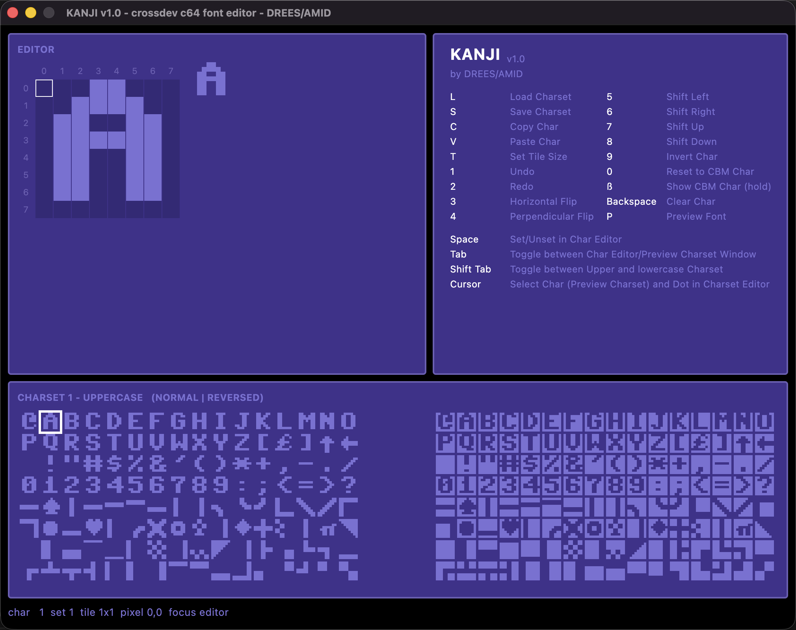

# KANJI

A cross-development character set editor for the Commodore 64.

KANJI edits C64 fonts on a modern desktop: draw a character pixel by pixel,
see the whole charset update live, and preview how your font looks as
multi-character tiles before it ever touches real hardware.



---

## Features

- **Both C64 charsets** — uppercase/graphics and lowercase, 256 characters each
- **Live preview** of the full charset, normal and reversed side by side
- **Tile formats** — 1x1, 1x2, 2x1 and 2x2, assembled exactly as the C64 does it
- **Font preview** showing characters 0–63 rendered as complete tiles
- **Transformations** — flip, shift, invert, clear, reset to the original CBM glyph
- **Undo/redo**, copy/paste between characters
- **Compare with the ROM** — hold a key to see the original CBM character
- Reads and writes plain **`.64c` / `.bin`** charset dumps

---

## Install

Download the archive for your system from the
[releases page](../../releases) — Windows, macOS and Linux, no Python
installation needed. You still need a chargen ROM (see below).

| System | Archive | Start |
|--------|---------|-------|
| Windows | `KANJI-windows.zip` | unpack, run `KANJI.exe` |
| macOS | `KANJI-macos.zip` | unpack, open `KANJI.app` |
| Linux | `KANJI-linux.zip` | unpack, run `./KANJI` |

On macOS the app is unsigned — the first start needs *right click → Open* to
get past Gatekeeper.

### From source

```bash
pip install -r requirements.txt
python3 kanji.py
```

Requires Python 3.9 or newer. To build a standalone app yourself you also need
the [Flutter SDK](https://docs.flutter.dev/get-started/install):

```bash
pip install -r requirements.txt
flet build macos --module-name kanji     # or: windows / linux
```

Pushing a `v*` tag builds all three platforms via GitHub Actions and attaches
the archives to the release. Each target has to be built on its own platform —
there is no cross-compilation.

### The chargen ROM

KANJI needs the original C64 character generator ROM. It provides the starting
charset and is the reference for *Reset to CBM Char* and *Show CBM Char*.

The file ships with [VICE](https://vice-emu.sourceforge.io/) as
`Roms/data/C64/chargen` (4096 bytes). On the first start KANJI searches the
usual install locations on macOS, Linux and Windows. If it finds one, the path
is stored in `kanji.json` next to `kanji.py` and reused on every later start.

If nothing is found, KANJI asks you to select the file. **Without a valid ROM
the app will not start** — cancelling the dialog quits it.

To use a different ROM later, delete `kanji.json` or edit the path inside it.
You can also drop a file named `chargen` next to `kanji.py`.

---

## The window

```
┌───────────────────────────┬───────────────────────────┐
│ (1) EDITOR                │ (2) KANJI + key reference │
│     pixel grid + tile     │                           │
│     preview               │                           │
├───────────────────────────┴───────────────────────────┤
│ (3) CHARSET — normal block | reversed block           │
│     or: FONT PREVIEW (tiles)                          │
├───────────────────────────────────────────────────────┤
│ status: char, charset, tile size, cursor, mode        │
└───────────────────────────────────────────────────────┘
```

**(1) Editor** — the selected character as an 8x8 grid with rulers. At larger
tile sizes the grid grows accordingly (up to 16x16 for 2x2). Click a pixel to
toggle it. Next to the grid sits a 1:1 preview of the assembled tile.

**(2) Key reference** — every function and its key.

**(3) Charset** — all 256 characters of the active charset: the normal block on
the left, the reversed block (+128) on the right. Click a character to select
it. Pressing `P` turns this pane into the font preview.

---

## Keys

| Key | Function |
|-----|----------|
| `L` | Load charset |
| `S` | Save charset |
| `C` | Copy character |
| `V` | Paste character |
| `T` | Cycle tile size (1x1 → 1x2 → 2x1 → 2x2) |
| `P` | Toggle font preview |
| `1` | Undo |
| `2` | Redo |
| `3` | Horizontal flip |
| `4` | Perpendicular flip |
| `5` | Shift left |
| `6` | Shift right |
| `7` | Shift up |
| `8` | Shift down |
| `9` | Invert character |
| `0` | Reset to the original CBM character |
| `ß` | Show the original CBM character (**hold**) |
| `Backspace` | Clear character |
| `Space` | Set/unset the pixel under the cursor |
| `Tab` | Switch focus between editor and charset |
| `Shift`+`Tab` | Switch between uppercase and lowercase charset |
| `←` `→` `↑` `↓` | Move the cursor (pixel in the editor, character in the charset) |

Shifts discard the bits that fall off the edge — they do not wrap around.
Undo covers the last 100 edits; loading a charset clears the history.

---

## Character sets

The C64 has two character sets of 256 characters each, and KANJI holds both in
memory at the same time. `Shift`+`Tab` switches between them.

**Charset 1 — uppercase / graphics**

| Range | Content |
|-------|---------|
| 0–63 | `A`–`Z`, `0`–`9`, punctuation |
| 64–127 | PETSCII graphics |
| 128–191 | reversed `A`–`Z`, `0`–`9`, punctuation |
| 192–255 | reversed PETSCII graphics |

**Charset 2 — lowercase**

| Range | Content |
|-------|---------|
| 0–63 | `a`–`z`, `0`–`9`, punctuation |
| 64–127 | `A`–`Z` and PETSCII graphics |
| 128–191 | reversed `a`–`z`, `0`–`9`, punctuation |
| 192–255 | reversed `A`–`Z` and PETSCII graphics |

Characters 128–255 are the reversed twins of 0–127 — that is what the right
half of the charset pane shows.

---

## How a character is stored

Each character is 8 bytes, one per pixel row, MSB on the left. A set bit is
foreground, a clear bit is background. The letter `A`:

```
row   128 64 32 16  8  4  2  1   byte
 1.     0  0  0  1  1  0  0  0     24    ...##...
 2.     0  0  1  1  1  1  0  0     60    ..####..
 3.     0  1  1  0  0  1  1  0    102    .##..##.
 4.     0  1  1  1  1  1  1  0    126    .######.
 5.     0  1  1  0  0  1  1  0    102    .##..##.
 6.     0  1  1  0  0  1  1  0    102    .##..##.
 7.     0  1  1  0  0  1  1  0    102    .##..##.
 8.     0  0  0  0  0  0  0  0      0    ........
```

For letters and digits it is common to leave the leftmost column and the
bottom row empty so characters do not run into each other on screen. PETSCII
graphics deliberately fill the full 8x8 cell.

---

## Tile formats

A 1x1 character is a single 8x8 cell in hires: one background colour, one
foreground colour. Larger letters are built from **several characters printed
next to each other**, and the C64 charset is laid out so the extra pieces are
already there:

- **SHIFT** = the character 64 positions later (`A` = `$01` → `$41`)
- **REVERSE** = the character 128 positions later

| Format | Layout | |
|--------|--------|--|
| **1x1** | `A` | a single character |
| **1x2** | `A` over `REVERSE A` | one wide, two tall |
| **2x1** | `A` `SHIFT A` | two wide, one tall |
| **2x2** | `A` `SHIFT A`<br>`REVERSE A` `SHIFT REVERSE A` | two wide, two tall |

So the rule is: **the piece to the right is SHIFT, the piece below is REVERSE.**

`T` cycles through the formats. The editor grid grows to the full tile, and
editing any part writes into the character that part actually belongs to — edit
the top right cell of a 2x2 tile and you are editing `SHIFT A`.

`P` shows characters 0–63 as finished tiles, which is the quickest way to check
whether a large font holds together.

Further reading:
[codebase64 — bigger letters](https://codebase64.net/doku.php?id=base:bigger_letters)

---

## File format

KANJI reads and writes `.64c` and `.bin` files — raw dumps of a character
generator ROM, uncompressed, 8 bytes per character:

| Size | Meaning |
|------|---------|
| 2048 bytes | one charset (256 characters) |
| 2050 bytes | one charset with a 2-byte load address in front |
| 4096 bytes | both charsets |
| 4098 bytes | both charsets with a load address |

**Loading** puts a 2048-byte file into the *active* charset and leaves the other
one untouched; a 4096-byte file replaces both. A load address is detected and
stripped automatically.

**Saving** always writes 2048 bytes — the active charset only. Switch with
`Shift`+`Tab` and save again to write the other one.

---

## Tests

```bash
python3 test_kanji.py
```

Covers the pixel transformations, the tile logic, key dispatch, file I/O and
the display modes. No test framework required.

---

## License

KANJI is MIT licensed — see [LICENSE](LICENSE).

### Dependencies

| Component | License | Used for |
|-----------|---------|----------|
| [Flet](https://flet.dev) | Apache-2.0 | the user interface |
| [Pillow](https://python-pillow.org) | MIT-CMU | rendering the charset preview as a PNG |
| [Flutter](https://flutter.dev) | BSD-3-Clause | pulled in by `flet build`, ships inside the binaries |

All three permit redistribution in binary form; their license texts are part
of the packages and travel with the released archives.

### Character ROM

KANJI ships **no** character ROM. It uses the one already installed with your
emulator (VICE and friends), which stays where it is — nothing is copied into
this project.

If none is found, the app offers to download the
[OpenROM](https://github.com/MEGA65/open-roms) character set
(`chargen_openroms.rom`, LGPL-3.0). It is fetched on demand into the program
folder and is not part of this repository, so no LGPL code is redistributed
here. The file can be replaced with any other 2 KB or 4 KB charset at any
time.

The original Commodore character ROM is copyrighted by Cloanto and is neither
bundled nor downloaded by KANJI — you supply it yourself, usually through an
emulator you already have installed.

---

## Credits

[DREES](https://github.com/drees64)/[AMID](https://github.com/AMID64) 2026
